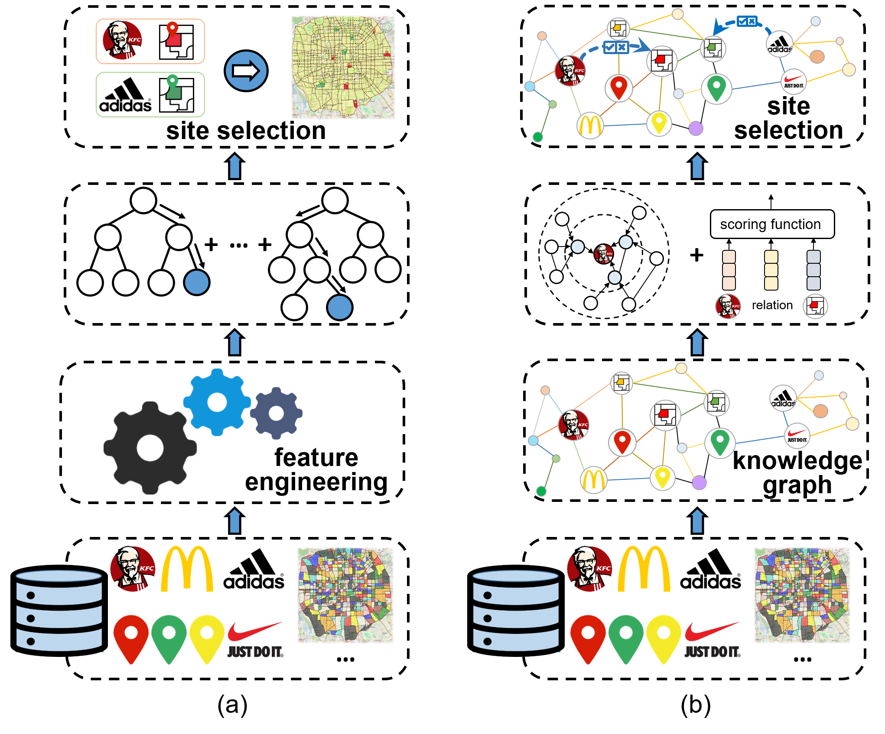

<<<<<<< HEAD
# KnowSite_implementation
This repository is the implementation of SIGSPATIAL'2023 submission paper "KnowSite: Leveraging Urban Knowledge Graph for Site Selection".
=======
# KnowSite: Leveraging Urban Knowledge Graph for Site Selection

 
>>>>>>> 8751e32121d3ad8d03074c0c8a90618eb6110365

## Requirements

To install requirements:

```setup
python 3.7.4
pytorch 1.1
dgl 0.5.1
mlflow 1.12.1
```

<<<<<<< HEAD

=======
>>>>>>> 8751e32121d3ad8d03074c0c8a90618eb6110365
## Running a model

To train (and evaluate) the model in the paper, run this command:

```
python main.py --dataset beijing --batch_size 128 --edim 64 --lr 0.001 --dr 0.995 --comp_opn rnn --dr 0.995 --freeze true --gcn_dropout 0.3 --kg_name kg_reverse --n_layer 2 --opn rotate --pretrain true --psa_alpha 0.5
python main.py --dataset shanghai --batch_size 128 --edim 64 --lr 0.003 --dr 0.995 --comp_opn rnn --dr 0.995 --freeze true --gcn_dropout 0.1 --kg_name kg_reverse --n_layer 2 --opn rotate --pretrain true --psa_alpha 0.8
```

<<<<<<< HEAD
## Running baselines or ablation study

To reproduce the baseline results or ablation study results, please execute the shell file in corresponding directories.
=======

## Reference

    @inproceddings{liu2023knowsite,
	title 	  = {KnowSite: Leveraging Urban Knowledge Graph for Site Selection},
	author	  = {Liu, Yu and Ding, Jingtao and Li, Yong},
	booktitle = {ACM SIGSPATIAL},
	year      = {2023}}
>>>>>>> 8751e32121d3ad8d03074c0c8a90618eb6110365
